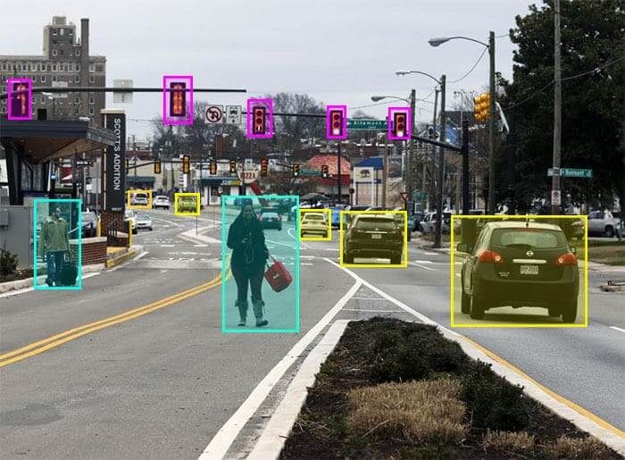
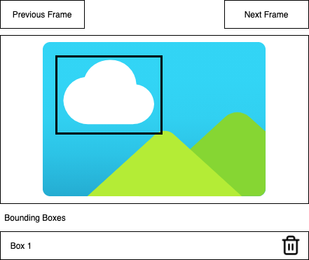

# Frame Labeler

## Introduction

Once of the infrastructure team's core responsibilities is building labeling tools. These tools help our computer vision engineers improve our AI by making it easier to create high-quality training data. Today, you'll be building a tool that lets users label a video by drawing bounding boxes around the objects that appear in each frame. The output of the tool will look similar to the image below, where bounding boxes are drawn around all the people, cars, and traffic lights:

<div align="center">
	
</div>

**This takehome should take no more than four hours.** If you're likely to go over time, please stop and send us what you have.  It's important to us that this project not become a massive time sink or a source of stress, so **we will expect a response from you within four hours and 15 minutes of receiving this message.**

## Requirements

Refer to the wireframe below as you read this section:

<div align="center">
	
</div>

At a high level, users can do the following:

1. Use the previous frame/next frame buttons to flip through video frames.
2. Draw one or more bounding boxes on each image. Bounding boxes will appear in a list below the image.
3. Delete bounding boxes using the list of bounding boxes below the image.

The specific requirements are:

1. The first frame of the video should appear when the page first loads.
2. Clicking the next/previous frame buttons should load the next/previous frame.
3. Clicking and dragging on the image should start drawing a new bounding box. The drawing experience is identical to how you select multiple icons on your computer's desktop. See the animated GIF below for an example: <div></div>
4. Releasing the mouse should stop drawing and save the bounding box's coordinates in memory.
5. The app should remember each frame's bounding boxes. For example, if I draw boxes on frame 0, go to frame 1, then go back to frame 0, I should see all the bounding boxes I drew on frame 0.
6. The bounding box list table should only display the bounding boxes associated with the current frame.
7. Clicking the trash icon in the bounding box list table should delete the bounding box referenced by that row.

## API Endpoints

`GET http://invisai-frontend-interview-data.s3-website-us-west-2.amazonaws.com/video.json`

Returns metadata about the video.

Return value:

```json
{
  "video_name": "A Video Name",
  "frame_count": 1234
}
```

- **video_name:** The name of the video.
- **frame_count:** The number of frames in the video.

`GET http://invisai-frontend-interview-data.s3-website-us-west-2.amazonaws.com/frames/:index.jpg`

Returns the image data for a particular frame. The `:index` parameter is padded to five digits. For example, the `:index` parameter for frame zero would be `00000`, and the index value for frame 100 would be `00100`.

## Takehome Rules

- You should write the UI in React with an eye towards component reusability and composability.
- You can use whatever state management solution you like.
- You can structure the app's state however you like.
- You can use whatever HTTP client (`fetch`, `axios`, etc.) you like.
- You can use whatever IDE or online resources you like.
- The solution is expected to function. No pseudocode, please.
- You don't need to write any automated tests for your code. That said, you are welcome to do so if you have time.
- You are welcome to use your favorite UI library (e.g. Bootstrap, Carbon UI, Tailwind CSS, etc.) if you have one.
- Please **do not** use third-party drawing libraries.
- Additional points will be awarded if you use the HTML5 Canvas API to render the bounding boxes, however this is not required.
- Please use the included boilerplate project as the starting point for your app. The boilerplate is based on `create-react-app`. If you're unfamiliar with `create-react-app`, instructions on running the project are in [BOOTSTRAP.md](./BOOTSTRAP.md). 

## Submitting Your Solution

Please send an e-mail to the person who gave you the link to this take-home question with the following:

- A screenshot of your solution running in your browser.
- A quick description of your solution that outlines the component hierarchy how it manages its state.
- A ZIP file containing your solution **without the node_modules directory**.

## Issues

If you have any questions issues during the course of the takehome, please call/text the cell number mentioned in the e-mail that sent you this prompt. That's the quickest way to reach us.